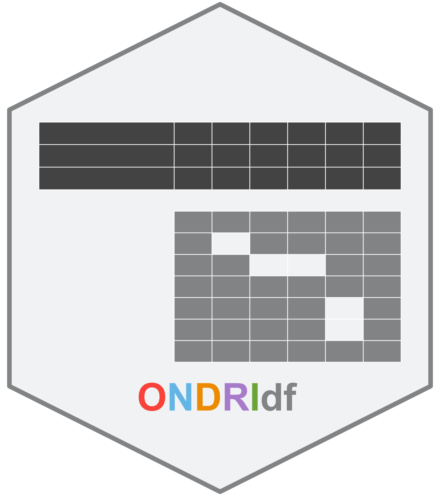

```{r setup, include=FALSE}
knitr::opts_chunk$set(echo = TRUE)
```

# ONDRIdf 


Before installing, you'll need a few other packages:


```{r, eval = F}

devtools::install_github(repo = "ondri-nibs/ondricolors")
install.packages('sticky')
install.packages('haven')
install.packages('purrr')

```


Get the package from this ONDRI-NIBS github repository

```{r, eval = F}

devtools::install_github(repo = "ondri-nibs/ONDRIdf")
# or
# remotes::install_github(repo = "ondri-nibs/ONDRIdf")

```


# An introduction to ONDRI data

ONDRI's data adhere to standards that we developed in order to harmonize across *very* diverse data types, data sets, and various backgrounds and expertise. The core of the data standards are that data sets require:


* A 'DATA' file with participants along the rows and variables along the columns. More details below.

* A 'DICT' (dictionary) file with variables down the rows (so transposed from its respective DATA file), and four columns to describe each variable: COLUMN_LABEL, DESCRIPTION, TYPE, and VALUES. 

* Some additional files to help supplement the package, such as describing any participants that are *entirely* missing (a 'MISSING' file), details on how the data were collected, curated, and prepared for release (a 'METHODS' file). See the ONDRI compendium for details


For ONDRI data, there are two specific standards that are conceptually important (even critical), but can be inconvenient to handle when reading the data. These are:

* ONDRI defined data *TYPES*, which generally conform to established typologies, and quickly convey information about how the data could or should be analyzed. The types include: TEXT, CATEGORICAL, NUMERIC, ORDINAL, DATE, TIME, and MIXED. See the ONDRI compendium for details on the definitions of each. However, it is important for many analyses that we are able to track these data types (as defined by ONDRI curators). Often, when reading in data to your preferred environment, these data types are converted to whatever the environment decides (e.g., in `R` TEXT or CATEGORICAL are often read as `character` or `factor`).

* ONDRI also specifies 10 types of MISSING data that are standard across the project. For the complete list see either the ONDRI compendium or a function in this package: `ONDRIdf::tagged_na_map()`. These codes for missing data are crucial: data are missing for very different reasons. For examples: (1) sometimes data cannot be obtained because impairment is so severe that certain tasks cannot be completed ("M_CB" which stands for "Missing: Cognitive/Behavioral"), and (2) sometimes data were not correctly or accurately collected which could have been due to administration error ("M_AE" which stands for "Missing: Administration error") or because of technical issues with equipment ("M_TE" which stands for "Missing: Technical error"). With different types of missing data, we want to be able to handle them in different ways. These types of missing will inform us on imputation strategies, whether or not to include or exclude certain participants, cohorts, or variables from analyses, and even provide for us key information on how and why data are "missing" throughout the entirety of the project.


# Ain't so easy though

Many environments---including and especially `R`---were not designed to read in and naturally handle data with some of these particularities. `R` has one type of missing called `NA` and has its own definitions of data types (which correspond to types in other environments and languages) including `numeric` (which itself includes `integer` and `double`).

So how can we keep track of 10 kinds of missing data, and keep track of more general terms for data types? We could (and at this time probably are) reading in multiple files, and maybe creating additional `data.frames` or `lists` to help us track all of this information. The **major** drawback there is that any update to the core DATA `data.frame` will not automatically update any additional information (such as missingess, data types, and so on). Fortunately, with some help from other `R` packages, the `ONDRIdf` package will do all this for us. 


# `ONDRIdf` makes it easy(ier?)

The `ONDRIdf` package generally has one goal: preserve the specifities of ONDRI's standards and handle them in `R`'s `data.frame` (the most common data structure for data manipulation and analyses in `R`).

The `ONDRIdf` package has a primary function called `ONDRI_df()` which reads in a 'DATA' and 'DICT' pair. From there, `ONDRI_df()` creates a special subclass of a `data.frame` called `ONDRI_df`. This helps us track features that are (somewhat) hidden in the `data.frame`. The important features are that: (1) tag each column with it's ONDRI data type and (2) uniquely identifies different types of `NA`. Both of these features are (somewhat) hidden with the help of the `haven` and `sticky` packages. The ONDRI types are tracked for you so you can always refer back to them within the `ONDRI_df` `data.frame`. More importantly, the types of `NA`s are not obvious in the `data.frame`, and even behave (almost) exactly like regular `NA`s. Instead, they become obvious through the `print` method or specifically asking for missing data via `ONDRIdf::find_missing()`.


# An example

Let's see `ONDRIdf` in action. We're going to read the `toy_data` directly from the ONDRI-NIBS Github page. Feel free to explore those data on your own, and see how we use data types and missing codes (find all the "M_" characters in the data).

```{r github_data}

DATA_FILE <- "https://raw.githubusercontent.com/ondri-nibs/toy_data/master/OND01_ALL_01_NIBS_SYNTHDATA_TABULAR_2020JUL26_DATAPKG/OND01_ALL_01_NIBS_SYNTHDATA_TABULAR_2020JUL26_DATA.csv"

DICTIONARY_FILE <- "https://raw.githubusercontent.com/ondri-nibs/toy_data/master/OND01_ALL_01_NIBS_SYNTHDATA_TABULAR_2020JUL26_DATAPKG/OND01_ALL_01_NIBS_SYNTHDATA_TABULAR_2020JUL26_DICT.csv"


```


And now we'll call the one function we need to maintain all the key information about data columns and magically handle the missingness.


```{r et_voila}
library(ONDRIdf)
my_ondri_df <- ONDRI_df(DATA_FILE, DICTIONARY_FILE)

```

Let's see how this `print`s

```{r print_odf}
my_ondri_df
```

You can see that there are some major differences from, say, if we were to just simply cast the data back to a standard data.frame with `as.data.frame(my_ondri_df)`. Here, we are showing a snapshot of the first few rows and the last few rows (this can be customized!). More importantly, we provide additional information. First you can see some introductory text telling us about the size & shape of the data. Next you can see that there are three new column headers. These tell us the variable name, ONDRI's data type, and how `R` treats the data (`R`s primitive types). Note that you can see the standard `<NA>` displayed in the data table. However, if you look to the bottom of the printed output, we see a new and smaller table with some introductory text. This bottom table tells us where we have missing data and which *types* they are. These behaviors are preserved just as they would be for data.frames, e.g.,


```{r print_smaller_odf}
my_ondri_df[,c(1,15:17)]
```

Note how we're now only showing a subset of variables, and that the missingness subtable reflects what we've chosen to focus on rather than the full table. 

A feature that is disappointingly missing in this markdown file is that some of the information is color coded when printed to the terminal (this is still an "aesthetic in progress").


# What else you got?

There are some helper functions in this package however they may change, be replaced, or disappear entirely at any time. These should be regarded as convenience functions that are, effectively, shortcuts for things you'd do on your own. If they ever cause problems or can be done simpler in other ways, they are likely to disappear in order to preserve the core functionality of `ONDRIdf` (which is pretty much one thing: keep all the important parts in one place).

Here are some examples of these helpers.

## DATES

In ONDRI, we specifically use the '%Y%b%d' date format which produces, e.g., `r toupper(format(Sys.time(), "%Y%b%d"))`. We do this because it creates a contract between ONDRI data curators and ONDRI data consumers. From the curation perspective we are definitively providing a date with no ambiguity. As a data consumer, you might prefer a more ambiguous albeit standard format. In the ONDRI data, dates look like

```{r ondridates}
my_ondri_df$NIBS_SYNTHDATA_DATE
```

But with a helper, we can get the more standard format:

```{r isodates}
convert_ondri_dates_to_iso_dates(my_ondri_df$NIBS_SYNTHDATA_DATE)
```

## Subsets of data

Generally there are two ways that `ONDRIdf` helps you get specific data types. The first is by retrieving the indices (and names) as `logical`s via `get_ondridf_column_data_types`. We need two parameters: the `ONDRIdf` and the text of the type. Let's get all the 'NUMERIC'

```{r get_col_names_base}
get_ondridf_column_names_by_data_type(my_ondri_df, "NUMERIC")
```

Fortunately, I've created a (barely) lazier way to do that 

```{r get_col_names_specific}
get_ondridf_column_names_by_NUMERIC(my_ondri_df)
```


An alternate to this is to retrieve the actual (sub) data.frame, as so:

```{r get_df_base}
get_ondridf_by_data_type(my_ondri_df, "NUMERIC")
```

And another (barely) lazier way to do that 

```{r get_df_specific}
get_ondridf_by_NUMERIC(my_ondri_df)
```

These above `get`ters exist for all the data types (if you've forgotten, see `ONDRIdf:::data_types()`, which is a hidden function)


And if ever you need to know all the types across all the columns: 

```{r get_all}
get_ondridf_column_data_types(my_ondri_df)
```


## Just the missing, please

Finally, a lot of the time we want to just focus on the missing data. So there's a function for that, too. And it simply retrieves a small `data.frame` for you that contains the indices (rows, columns), names (variables, and subjects if available), missing types ("M_*"), and special types of `NA`s provided by `haven` (we'll see how this works a bit at the end).

To get the missing data for an `ONDRIdf`:

```{r get_missing}
find_missing(my_ondri_df)
```

And we can do this for any arbitrary subset, such as:

```{r get_missing_arbsub}
find_missing(my_ondri_df[,c(1,15:17)])
```

Or we can get more specific and less arbitrary:

```{r get_missing_numericsub}
find_missing(get_ondridf_by_NUMERIC(my_ondri_df))
```


### The `NA`s

The `NA`s we see in the `HAVEN_NA` column all *look* the same, but they aren't! They are how we can map *types* of `NA`s in `R` to ONDRI's missing codes. 


```{r haven}

numeric_missing <- find_missing(get_ondridf_by_NUMERIC(my_ondri_df))

haven::na_tag(numeric_missing$HAVEN_NA)

```

We can see extra letters after the `NA`. These are actually stored in a special byte hidden deep down in some `C` code we don't want to know more about. But we do have flexibility to add up to 26 (or possibly 52, maybe more?) types of missing with the use of single characters. The drawback is we have to handle the mapping ourselves. For that mapping, see `tagged_na_map()`


# Some examples


The way in which missingness and types are tracked can help us set up easier rules for data manipulation and especially imputation. Let's start with a relatively "straight forward" problem: numeric data and imputation. Let's get the data we need, first:

```{r just_numeric}

library(tidyverse)
library(magrittr)


which_numeric_columns <- which(get_ondridf_column_names_by_NUMERIC(my_ondri_df))

my_ondri_df %>%
  select(SUBJECT, which_numeric_columns) ->
  my_ondri_df_numeric_subset

```

Now, let's explore the missingness.

```{r see_missing}
my_ondri_df_numeric_subset %>%
  find_missing()
```


We can see three different missing codes: "M_AE" which is administrative error, "M_CB" which is cognitive/behavioral, and "M_ART" which is due to artifacts (in this case in the neuroimaging data). We usually consider "M_CB" very different from most other missing types, and in some cases impute these values to a maximum or minimum (whichever is the worst for the instrument). Note that these max or min values could be one of several options, such as a hypothetical max or min, the upper or lower bound on the instrument, or we can use the min or max from the sample. For now, let's set up some code to impute the "M_CB" values to the worst performance for their measures, and do so with the *observed sample*. Here we can see that all "M_CB" are in one of the timed tasks, so we want to impute to the maximum observed value.


```{r get_cb_missing}
my_ondri_df_numeric_subset %>%
  find_missing() %>%
  filter(M_CODES == "M_CB") -> 
  current_cb_missing
```

Let's now set up our values for replacement

```{r impute_cb_max}

my_ondri_df_numeric_subset %>%
    select(unique(current_cb_missing$VARIABLE_NAMES)) %>% purrr::map(., max, na.rm=T) -> column_wise_maxes

my_ondri_df_numeric_subset %>% 
  replace_na(as.list(column_wise_maxes)) ->
  my_ondri_df_numeric_subset_no_cb


```


And now we're left with just the other missing types:

```{r no_more_cb}
# either look at the whole thing
# my_ondri_df_numeric_subset_no_missing
# or just the missingness:
my_ondri_df_numeric_subset_no_cb %>%
  find_missing()

```

Per usual, these are the kinds of missing where we usually feel comfortable with `missMDA` doing the work for us. Note that by moving over to `missMDA` we're going to need to analyze and end up with a `matrix`, not a `data.frame` and, more importantly, we do now lose all of the nice features of `ONDRIdf`. However, given that our goal with this step is to eliminate the remaining `NA`s, we're OK with that.

```{r impute_remaining}

my_ondri_df_numeric_subset_no_cb %>%
  select(-SUBJECT) %>%
  missMDA::imputePCA(.) %>%
  purrr::pluck("completeObs") ->
  my_ondri_df_no_missing


rownames(my_ondri_df_no_missing) <- my_ondri_df_numeric_subset_no_cb$SUBJECT

```
